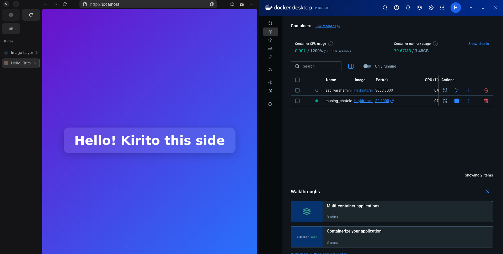

## This is a simple web app to demonstrate Github Actions with CI/CD pipeline

## STEPS

1. Code written for the app locally
2. The code is pushed to Github for version control and workflows
3. Github Actions
- Installed Dependencies
- Add docker creds in GIthub Secrets
- Build the docker image and pushed on DockerHub

4. DockerHub - Store and built docker images

Here's ss of running app

